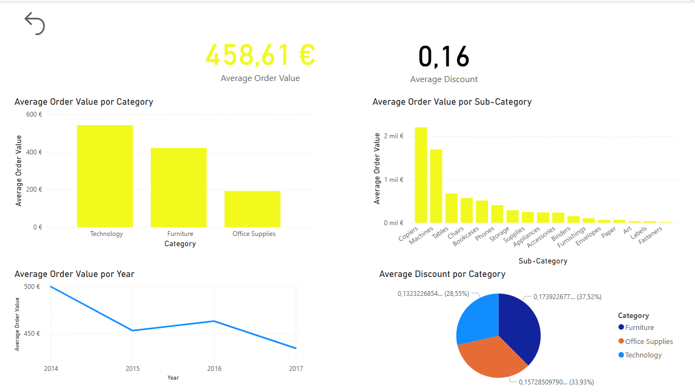

# 📊 Superstore Sales Dashboard – Power BI Project

This project analyzes the Superstore dataset using Power BI to extract insights about sales, profitability, and customer behavior. The dashboard provides an interactive experience to explore business performance across different dimensions such as time, category, and location.

---

## 📁 Dataset

- **Source**: [Kaggle – Superstore Sales Dataset](https://www.kaggle.com/datasets/vivek468/superstore-dataset-final)
- The dataset includes information about orders, customers, products, sales, profit, discounts, and shipping details.

---

## 🎯 Project Objectives

- Clean and transform raw data for analysis in Power BI
- Create dynamic and interactive visualizations
- Build key business KPIs (e.g. Total Sales, Profit Margin, Average Order Value)
- Apply drill-through functionality for deeper exploration
- Design a user-friendly dashboard suitable for business decision-making

---
 
## 🧰 Tools & Skills Used

- **Power BI**
- **DAX** for calculated measures
- **Data modeling** and **data transformation**
- **Time intelligence** using a custom date table
- **Drill-through and filters** for interactivity
- **Dashboard design** and storytelling

---

## 📊 Dashboard Pages Overview

1. **Overview**  
   - KPIs: Total Sales, Total Profit, Profit Margin  
   - Sales trend by year and sales share by category

2. **Sales Analysis**  
   - Sales by year and by month  
   - Filter by product category  
   - 💡 *Right-click on a category to see product-level details (drill-through)*

3. **Ticket & Discount**  
   - Average order value and discount by category and sub-category  
   - Visuals: bar charts, donut charts

4. **Profit Analysis**  
   - Profit trends by year, category, and city  
   - Interactive filters for deeper exploration

---

## 🖼️ Preview

---

## 📦 Files

- `SuperstoreDashboard.pbix` – Power BI file
- `README.md` – Project description
- `/images/` – Screenshots of the dashboard

---

## 📌 Notes

- This project was built for learning and portfolio purposes.
- The dataset is publicly available and does not contain sensitive data.

---

## 🙋‍♂️ About Me

I'm currently transitioning into the fields of Business Intelligence and Data Analyticswith a background in finance and controlling. This project demonstrates my ability to turn raw data into meaningful insights using Power BI.

📫 [LinkedIn Profile](https://www.linkedin.com/in/victor-román-ramos-b5267412b)

